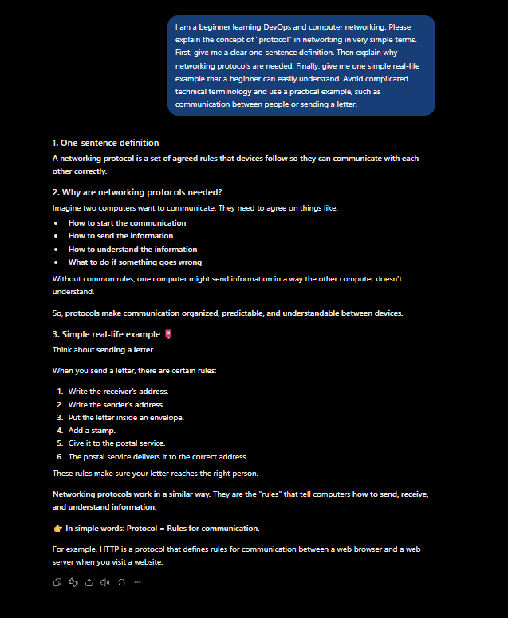
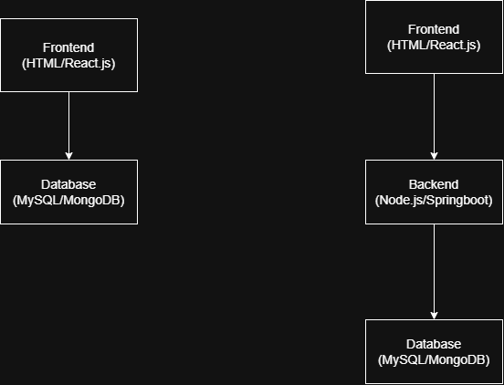
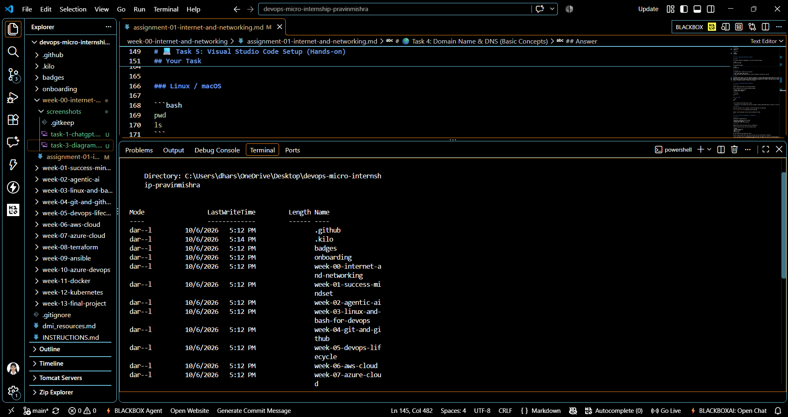

# Week 00 - Internet and Networking

Part of the DevOps Micro Internship (DMI) with Agentic AI

---

# 🧑‍💻 Task 1: Using ChatGPT as Your Learning Assistant

## Scenario

You're new to DevOps and will frequently encounter technical questions. ChatGPT can be your learning companion.

## Your Task

Write a clear ChatGPT prompt to help you understand:

> "What is a protocol in networking? Explain with a simple real-life example."

Take a screenshot of your interaction showing:

* Your detailed prompt (with clear expectations)
* ChatGPT's simplified response with an example

## Screenshot

Save your screenshot in the `screenshots` folder and update the file name below.




Replace `task-1-chatgpt.png` with your actual screenshot file name.

---

## What I Learned (2–3 lines)

I learned that a networking protocol is a set of rules that allows devices to communicate with each other. The real-life examples helped me understand how protocols make communication organized and reliable.

---

# 🌐 Task 2: Internet and Networking

## Scenario

Your friend is launching an online bookstore named **EpicReads**.

He asked you to explain how users globally can access his website hosted in Finland.

## Your Task

Write a short explanation (**100–150 words**) that includes:

* Packet Switching
* IP Address
* TCP/IP
* HTTP/HTTPS

💡 **Tip:** You may use ChatGPT (as demonstrated in Task 1) to refine your explanation.

## Answer

When a user anywhere in the world wants to visit the EpicReads website hosted in Finland, the request is divided into small packets through packet switching. These packets travel across different networks and routers to reach the server. The server has a unique IP address that helps identify its location on the internet. TCP/IP provides the basic rules for sending and receiving these packets reliably between the user's device and the server. Once the connection is established, the browser uses HTTP or HTTPS to request and receive web pages from the EpicReads server. HTTPS is preferred because it encrypts the communication and protects sensitive information such as login details and payment data. Finally, the received packets are reassembled by the user's device, allowing the website to appear in the browser.

---

# 🏗️ Task 3: Application Architecture & Stack

## Scenario

EpicReads bookstore has two application versions:

### Two-Tier Application

* Frontend
* Database

### Three-Tier Application

* Frontend
* Backend
* Database

## Your Task

* Draw simple diagrams (hand-drawn or tool-based such as draw.io)
* Label each layer clearly
* List at least two common technologies or tools used for each layer
* Submit a screenshot or photo clearly showing your own drawing

## Diagram Screenshot / Photo

Save your diagram image in the `screenshots` folder and update the file name below.




Replace `task-3-diagram.png` with your actual diagram file name.

---

## Technologies Used

### Frontend

* React.js
* HTML/CSS/JavaScript

### Backend

* Spring Boot
* Node.js

### Database

* MySQL
* MongoDB

---

# 🌍 Task 4: Domain Name & DNS (Basic Concepts)

## Scenario

Your friend's bookstore **EpicReads** is currently accessible through:

```text
52.172.142.222:3000
```

He purchased the domain:

```text
epicreads.com
```

## Your Task

In **50–100 words**, explain in your own words:

1. What is DNS (Domain Name System)?
2. Which DNS record type should be used to connect the domain to the given IP, and why?

## Answer

DNS (Domain Name System) is like the internet's phonebook. It converts human-friendly domain names such as epicreads.com into IP addresses that computers use to locate servers. To connect epicreads.com to the given IPv4 address 52.172.142.222, an A record should be used. The A record maps a domain name to an IPv4 address. When a user enters epicreads.com in a browser, DNS looks up the A record and returns the server's IP address, allowing the browser to connect to the website.

---

# 💻 Task 5: Visual Studio Code Setup (Hands-on)

## Your Task

Install Visual Studio Code (if not already installed).

Take a screenshot of your VS Code environment showing:

* Terminal open inside VS Code
* Running a basic command:

### Windows

```powershell
dir
```

### Linux / macOS

```bash
pwd
ls
```

* Your selected VS Code theme clearly visible

⚠️ **Important:** The screenshot must show your username or another identifiable detail to confirm it is your environment.

## Screenshot

Save your screenshot in the `screenshots` folder and update the file name below.




Replace `task-5-vscode.png` with your actual screenshot file name.

---

# 🔗 Task 6: Publish Your Assignment as a LinkedIn Post

## Objective

Publishing on LinkedIn helps you:

* Build your professional online presence
* Reinforce your learning
* Document your DevOps journey publicly

## Your Task

Summarize your answers from Tasks 1–5 into a LinkedIn post.

Clearly structure your post into the following sections:

* ChatGPT
* Internet & Networking
* App Architecture
* DNS
* VS Code Setup

Use the credit note that matches your track:

Add the following credit note at the end of your post **(If you are DMI Cohort 3 student)**:

> **P.S. This post is part of the DevOps Micro Internship (DMI) with Agentic AI — Cohort 3 — by Pravin Mishra. My graded progress is public: https://dmi.pravinmishra.com/s/YOUR-GITHUB-USERNAME.html · Start your DevOps journey: https://dmi.pravinmishra.com/?utm_source=student&utm_medium=ps-linkedin&utm_campaign=cohort3**

**Tag [Pravin Mishra](https://www.linkedin.com/in/pravin-mishra-aws-trainer/) in your LinkedIn post, then tag Lead Co-Mentor — [Anjana Muthunayake](https://www.linkedin.com/in/anjana-muthunayake/).**

Add the following credit note at the end of your post **(If you are DMI Self-paced track student)**:

> **P.S. This post is part of the DevOps Micro Internship (DMI) — Self-Paced Engineer Track — by Pravin Mishra. My graded progress is public: https://dmi.pravinmishra.com/s/YOUR-GITHUB-USERNAME.html · Start your DevOps journey: https://dmi.pravinmishra.com/?utm_source=student&utm_medium=ps-linkedin&utm_campaign=self-paced**

Add the following credit note at the end of your post **(If you are DMI Campus student)**:

> **P.S. This post is part of the DevOps Micro Internship (DMI) — Campus — by Pravin Mishra. My graded progress is public: https://dmi.pravinmishra.com/s/YOUR-GITHUB-USERNAME.html · Start your DevOps journey: https://dmi.pravinmishra.com/?utm_source=student&utm_medium=ps-linkedin&utm_campaign=campus**

**Tag [Pravin Mishra](https://www.linkedin.com/in/pravin-mishra-aws-trainer/) in your LinkedIn post, then tag Lead Co-Mentor — [Anjana Muthunayake](https://www.linkedin.com/in/anjana-muthunayake/).**

Hashtags:

#DMIByPravinMishra #AgenticAI #DevOps

Replace `YOUR-GITHUB-USERNAME` with your GitHub username — that link is your public DMI progress page (your graded badge page).
---

## LinkedIn Post URL

Paste your LinkedIn post URL here:

```text
https://lnkd.in/p/gE68RGGs
```

---

## LinkedIn Post Backup Copy

Paste the full text of your LinkedIn post here:

🚀 Week 00 Completed — DevOps Micro Internship (DMI)

I’ve started my DevOps learning journey through the DevOps Micro Internship (DMI) — Self-Paced Engineer Track by Pravin Mishra.

Here’s what I learned and practiced in Week 00:
🔹 ChatGPT
Learned how to use ChatGPT as a learning assistant to understand technical concepts in a simple and practical way. I explored the concept of networking protocols using a real-life example.
🌐 Internet and Networking
Learned how packet switching, IP addresses, TCP/IP, and HTTP/HTTPS work together when accessing a website hosted on a remote server.
🏗️ App Architecture
Explored two-tier and three-tier application architectures and learned about common frontend, backend, and database technologies.
🌍 DNS
Understood how DNS converts a domain name into an IP address and learned how an A record connects a domain such as epicreads.com to an IPv4 address.
💻 VS Code Setup
Set up my development environment in Visual Studio Code and practiced using the integrated terminal with basic commands.

This week helped me strengthen my understanding of basic networking and application architecture concepts that form an important foundation for DevOps.

📚 Looking forward to learning, building, and improving further in the upcoming weeks!

Pravin Mishra Anjana Muthunayake

P.S. This post is part of the DevOps Micro Internship (DMI) — Self-Paced Engineer Track — by Pravin Mishra. 
My graded progress is public:
https://lnkd.in/gj8zutfX · 
Start your DevOps journey: https://lnkd.in/gshNMKtK

#DMIByPravinMishra #AgenticAI #DevOps

---

# Reflection – Week 0

### What did you find easy?

I found it easy to understand basic networking concepts such as IP addresses, DNS, and protocols using simple real-life examples. Setting up and using VS Code was also easy because I was already familiar with the editor.

---

### What was difficult?

Understanding how different networking concepts work together was slightly difficult at first, especially packet switching, TCP/IP, and HTTP/HTTPS. Creating the application architecture diagrams also required me to think about how each layer communicates with the others.

---

### What will you improve next week?

I will improve my understanding of DevOps concepts by practicing more hands-on tasks instead of only learning the theory. I also want to become more comfortable with Linux commands, Git, and GitHub workflows as I progress through the internship.

---

## 📌 About DMI & CloudAdvisory

DevOps Micro Internship (DMI) is a project-based DevOps program run by Pravin Mishra (The CloudAdvisory) focused on real-world execution, systems thinking, and career readiness.

It helps learners build strong DevOps foundations with hands-on experience.


## 📌 Resources

- 🌐 **DMI Official Website:** https://dmi.pravinmishra.com?utm_source=github&utm_medium=readme  
- 🎓 **University:** https://university.pravinmishra.com?utm_source=github&utm_medium=readme  
- 💬 **Discord Community:** https://discord.pravinmishra.com?utm_source=github&utm_medium=readme  
- 📝 **Blog:** https://dmi.pravinmishra.com/blog?utm_source=github&utm_medium=readme  
- ▶️ **YouTube Playlist (DMI Cohort 3):** https://www.youtube.com/playlist?list=PLFeSNDtI4Cho  
- 🔗 **Pravin Mishra (LinkedIn):** https://www.linkedin.com/in/pravin-mishra-aws-trainer/  
- 🏢 **CloudAdvisory (LinkedIn):** https://www.linkedin.com/company/thecloudadvisory/

---

*This submission is part of DevOps Micro Internship (DMI) — Agentic AI Track*